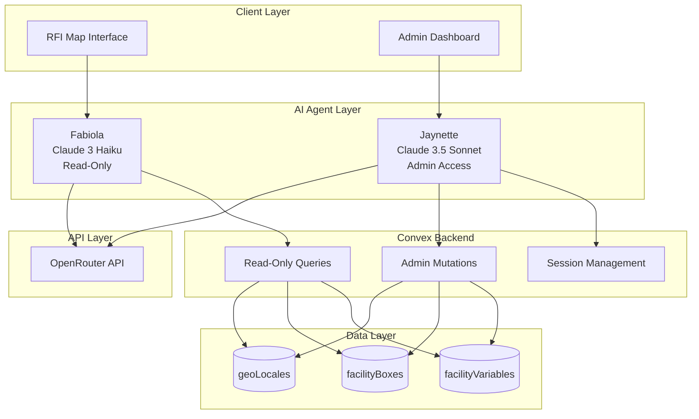

## Puerto Rico Logistics Grid Implementation Guide

## Table of Contents

1. [Architecture Overview](https://claude.ai/chat/a9dee357-dc53-423b-848d-8b79f5a3c04c#architecture-overview)
2. [Design Decisions](https://claude.ai/chat/a9dee357-dc53-423b-848d-8b79f5a3c04c#design-decisions)
3. [Agent Specifications](https://claude.ai/chat/a9dee357-dc53-423b-848d-8b79f5a3c04c#agent-specifications)
4. [Implementation Plan](https://claude.ai/chat/a9dee357-dc53-423b-848d-8b79f5a3c04c#implementation-plan)
5. [Tool Definitions](https://claude.ai/chat/a9dee357-dc53-423b-848d-8b79f5a3c04c#tool-definitions)
6. [Security Model](https://claude.ai/chat/a9dee357-dc53-423b-848d-8b79f5a3c04c#security-model)
7. [Deployment Strategy](https://claude.ai/chat/a9dee357-dc53-423b-848d-8b79f5a3c04c#deployment-strategy)
8. [Testing Framework](https://claude.ai/chat/a9dee357-dc53-423b-848d-8b79f5a3c04c#testing-framework)

---

## Architecture Overview

### System Design Philosophy

We implement a **dual-agent architecture** with clear separation of concerns:

- **Fabiola**: Public-facing assistant for map exploration and logistics queries (Claude 3 Haiku via OpenRouter)
- **Jaynette**: Administrative assistant for data management (Claude 3.5 Sonnet via OpenRouter)

This separation ensures security, cost optimization, and specialized functionality for each use case.

### High-Level Architecture



---

## Design Decisions

### 1. Why Two Separate Agents?

**Decision**: Implement Fabiola and Jaynette as distinct agents rather than a single dual-interface agent.

**Rationale**:

- **Security Isolation**: Complete separation between public and admin functions
- **Cost Optimization**: Haiku for high-volume public queries ($0.25/1M tokens) vs Sonnet for complex admin tasks ($3/1M tokens)
- **Specialized Prompting**: Each agent can have optimized system prompts for their specific domain
- **Audit Trail**: Clear distinction in logs between public and admin operations
- **Scalability**: Independent scaling based on usage patterns

### 2. Why OpenRouter?

**Decision**: Use OpenRouter as the API gateway for Claude models.

**Rationale**:

- **Unified Interface**: Single API for multiple model providers
- **Fallback Options**: Can switch models if one is unavailable
- **Cost Tracking**: Built-in usage analytics and billing
- **Rate Limiting**: Handled at the provider level
- **Model Flexibility**: Easy to test different models without code changes

### 3. Technology Stack Decisions

|Component|Technology|Rationale|
|---|---|---|
|**AI Gateway**|OpenRouter|Unified API, fallback support, cost tracking|
|**Public Agent**|Claude 3 Haiku|Fast, cost-effective for simple queries|
|**Admin Agent**|Claude 3.5 Sonnet|Advanced reasoning for complex data operations|
|**Backend**|Convex|Real-time, serverless, built-in auth|
|**Tool Framework**|Convex Actions|Type-safe, integrated with database|
|**Frontend**|Next.js + React|Existing stack, good DX|
|**Chat UI**|Custom Components|Full control over UX|

---

## Agent Specifications

### Fabiola - Public Assistant

```typescript
interface FabiolaConfig {
  model: "anthropic/claude-3-haiku";
  temperature: 0.3;
  maxTokens: 1024;
  systemPrompt: string;
  tools: ReadOnlyTool[];
  rateLimit: {
    requestsPerMinute: 20;
    requestsPerHour: 200;
  };
}
```

**Personality & Capabilities**:

- Friendly, helpful logistics assistant
- Bilingual (English/Spanish) responses
- Focuses on information retrieval and guidance
- Cannot modify data, only read and search
- Provides facility recommendations based on user needs

**Primary Use Cases**:

1. Search facilities by type, region, or name
2. Get detailed facility information
3. Filter and explore map markers
4. Answer logistics-related questions
5. Provide route recommendations

### Jaynette - Administrative Assistant

```typescript
interface JaynetteConfig {
  model: "anthropic/claude-3.5-sonnet-20241022";
  temperature: 0.1;
  maxTokens: 4096;
  systemPrompt: string;
  tools: AdminTool[];
  authentication: "session-based";
  auditLogging: true;
}
```

**Personality & Capabilities**:

- Professional, precise data management assistant
- Focuses on accuracy and validation
- Can perform CRUD operations on all database tables
- Validates data before operations
- Provides operation summaries and confirmations

**Primary Use Cases**:

1. Natural language data entry
2. Bulk import from various formats
3. Data validation and correction
4. Database queries and reports
5. Facility information updates

---

## Implementation Plan

### Phase 1: Foundation (Day 1 - Morning)

#### 1.1 Environment Setup

Create `.env.local`:

```env
# OpenRouter API
OPENROUTER_API_KEY=sk-or-v1-xxxxx

# Model Selection
FABIOLA_MODEL=anthropic/claude-3-haiku
JAYNETTE_MODEL=anthropic/claude-3.5-sonnet-20241022

# Security
ADMIN_SECRET_KEY=existing-key-from-convex
ADMIN_INTERFACE_PASSWORD=secure-password-here

# Optional Services
SERPER_API_KEY=for-web-search-capability
```

#### 1.2 Install Dependencies

```bash
# Core dependencies
npm install openai zod ai

# Optional enhancements
npm install react-markdown react-syntax-highlighter
npm install sonner # for toast notifications
npm install framer-motion # for animations
```

#### 1.3 OpenRouter Client Setup

Create `lib/openrouter/client.ts`:

```typescript
import OpenAI from 'openai';

export const openrouter = new OpenAI({
  baseURL: 'https://openrouter.ai/api/v1',
  apiKey: process.env.OPENROUTER_API_KEY!,
  defaultHeaders: {
    'HTTP-Referer': process.env.NEXT_PUBLIC_SITE_URL || 'http://localhost:3000',
    'X-Title': 'Puerto Rico Logistics Grid',
  },
});

export const MODELS = {
  FABIOLA: process.env.FABIOLA_MODEL || 'anthropic/claude-3-haiku',
  JAYNETTE: process.env.JAYNETTE_MODEL || 'anthropic/claude-3.5-sonnet-20241022',
} as const;

export async function createCompletion(
  model: keyof typeof MODELS,
  messages: any[],
  tools?: any[],
  temperature: number = 0.3
) {
  try {
    const response = await openrouter.chat.completions.create({
      model: MODELS[model],
      messages,
      tools,
      temperature,
      max_tokens: model === 'JAYNETTE' ? 4096 : 1024,
    });
    
    return response;
  } catch (error) {
    console.error(`OpenRouter API error for ${model}:`, error);
    throw error;
  }
}
```

### Phase 2: Fabiola Implementation (Day 1 - Afternoon)

#### 2.1 Tool Definitions

Create `convex/fabiola/tools.ts`:

```typescript
import { query } from "../_generated/server";
import { v } from "convex/values";

// Tool 1: Search facilities
export const searchFacilities = query({
  args: {
    search: v.optional(v.string()),
    type: v.optional(v.string()),
    region: v.optional(v.string()),
  },
  handler: async (ctx, args) => {
    let q = ctx.db.query("geoLocales");
    
    if (args.type) {
      q = q.filter((item) => item.eq(item.field("type"), args.type));
    }
    
    if (args.region) {
      q = q.filter((item) => item.eq(item.field("region"), args.region));
    }
    
    const results = await q.take(20);
    
    // Filter by search term if provided
    if (args.search) {
      const searchLower = args.search.toLowerCase();
      return results.filter(r => 
        r.name.toLowerCase().includes(searchLower) ||
        r.description?.toLowerCase().includes(searchLower)
      );
    }
    
    return results;
  },
});

// Tool 2: Get facility details with boxes and variables
export const getFacilityDetails = query({
  args: {
    facilityId: v.id("geoLocales"),
  },
  handler: async (ctx, args) => {
    const facility = await ctx.db.get(args.facilityId);
    if (!facility) return null;
    
    // Get all boxes for this facility
    const boxes = await ctx.db
      .query("facilityBoxes")
      .withIndex("by_geoLocaleId", q => q.eq("geoLocaleId", args.facilityId))
      .collect();
    
    // Get variables for each box
    const boxesWithVariables = await Promise.all(
      boxes.map(async (box) => {
        const variables = await ctx.db
          .query("facilityVariables")
          .withIndex("by_boxId", q => q.eq("boxId", box._id))
          .collect();
        
        return { ...box, variables };
      })
    );
    
    return {
      ...facility,
      boxes: boxesWithVariables,
    };
  },
});

// Tool 3: Get facilities by coordinates/area
export const getFacilitiesNearby = query({
  args: {
    lat: v.number(),
    lng: v.number(),
    radiusKm: v.optional(v.number()),
  },
  handler: async (ctx, args) => {
    const radius = args.radiusKm || 10;
    
    // Simple distance calculation (for Puerto Rico's small area)
    const facilities = await ctx.db.query("geoLocales").collect();
    
    return facilities.filter(f => {
      const distance = calculateDistance(
        args.lat, args.lng,
        f.coordinates.lat, f.coordinates.lng
      );
      return distance <= radius;
    }).map(f => ({
      ...f,
      distance: calculateDistance(
        args.lat, args.lng,
        f.coordinates.lat, f.coordinates.lng
      ),
    })).sort((a, b) => a.distance - b.distance);
  },
});

// Tool 4: Get facility statistics
export const getFacilityStats = query({
  args: {},
  handler: async (ctx) => {
    const facilities = await ctx.db.query("geoLocales").collect();
    
    const stats = {
      total: facilities.length,
      byType: {} as Record<string, number>,
      byRegion: {} as Record<string, number>,
      activeCount: facilities.filter(f => f.isActive).length,
    };
    
    facilities.forEach(f => {
      stats.byType[f.type] = (stats.byType[f.type] || 0) + 1;
      if (f.region) {
        stats.byRegion[f.region] = (stats.byRegion[f.region] || 0) + 1;
      }
    });
    
    return stats;
  },
});

// Helper function
function calculateDistance(lat1: number, lon1: number, lat2: number, lon2: number): number {
  const R = 6371; // Earth's radius in km
  const dLat = (lat2 - lat1) * Math.PI / 180;
  const dLon = (lon2 - lon1) * Math.PI / 180;
  const a = 
    Math.sin(dLat/2) * Math.sin(dLat/2) +
    Math.cos(lat1 * Math.PI / 180) * Math.cos(lat2 * Math.PI / 180) *
    Math.sin(dLon/2) * Math.sin(dLon/2);
  const c = 2 * Math.atan2(Math.sqrt(a), Math.sqrt(1-a));
  return R * c;
}
```

#### 2.2 Fabiola Action

Create `convex/fabiola/chat.ts`:

```typescript
import { action } from "../_generated/server";
import { v } from "convex/values";
import { api } from "../_generated/api";
import { createCompletion } from "@/lib/openrouter/client";

const FABIOLA_PROMPT = `You are Fabiola, a friendly AI assistant for the Puerto Rico Logistics Grid.

Your role is to help users explore and understand logistics facilities across Puerto Rico, including warehouses, ports, airports, and distribution centers.

Key responsibilities:
1. Help users find facilities that meet their needs
2. Provide detailed information about specific facilities
3. Explain logistics capabilities and services
4. Answer questions about Puerto Rico's logistics infrastructure
5. Guide users in using the interactive map

Personality traits:
- Friendly and helpful
- Bilingual (respond in the language used by the user)
- Knowledgeable about Puerto Rico geography
- Focus on practical logistics solutions

Important guidelines:
- You can ONLY read data, never modify it
- If asked about data updates, politely explain you're read-only
- When coordinates are mentioned, always validate they're within Puerto Rico (17.5-18.6°N, 65.0-67.5°W)
- Be specific about facility capabilities when known
- Suggest alternatives if exact matches aren't found`;

export const chat = action({
  args: {
    messages: v.array(v.object({
      role: v.union(v.literal("user"), v.literal("assistant")),
      content: v.string(),
    })),
    context: v.optional(v.object({
      currentView: v.optional(v.string()),
      selectedFacility: v.optional(v.string()),
    })),
  },
  handler: async (ctx, args) => {
    // Rate limiting check
    // ... rate limit logic ...
    
    // Tool definitions for OpenRouter
    const tools = [
      {
        type: "function",
        function: {
          name: "search_facilities",
          description: "Search for logistics facilities by name, type, or region",
          parameters: {
            type: "object",
            properties: {
              search: { type: "string", description: "Search term" },
              type: { 
                type: "string", 
                enum: ["warehouse", "port", "airport", "facility"],
                description: "Facility type" 
              },
              region: { 
                type: "string",
                enum: ["north", "south", "east", "west", "central"],
                description: "Geographic region" 
              },
            },
          },
        },
      },
      {
        type: "function",
        function: {
          name: "get_facility_details",
          description: "Get detailed information about a specific facility",
          parameters: {
            type: "object",
            properties: {
              facilityId: { type: "string", description: "Facility ID" },
            },
            required: ["facilityId"],
          },
        },
      },
      {
        type: "function",
        function: {
          name: "get_nearby_facilities",
          description: "Find facilities near specific coordinates",
          parameters: {
            type: "object",
            properties: {
              lat: { type: "number", description: "Latitude" },
              lng: { type: "number", description: "Longitude" },
              radiusKm: { type: "number", description: "Search radius in kilometers" },
            },
            required: ["lat", "lng"],
          },
        },
      },
      {
        type: "function",
        function: {
          name: "get_statistics",
          description: "Get statistics about facilities in the system",
          parameters: {
            type: "object",
            properties: {},
          },
        },
      },
    ];
    
    // Call OpenRouter
    const completion = await createCompletion(
      'FABIOLA',
      [
        { role: "system", content: FABIOLA_PROMPT },
        ...args.messages,
      ],
      tools,
      0.3
    );
    
    // Handle tool calls
    if (completion.choices[0].message.tool_calls) {
      const toolCalls = completion.choices[0].message.tool_calls;
      const toolResults = [];
      
      for (const toolCall of toolCalls) {
        const args = JSON.parse(toolCall.function.arguments);
        
        switch (toolCall.function.name) {
          case "search_facilities":
            const results = await ctx.runQuery(api.fabiola.tools.searchFacilities, args);
            toolResults.push({
              tool_call_id: toolCall.id,
              content: JSON.stringify(results),
            });
            break;
            
          case "get_facility_details":
            const details = await ctx.runQuery(api.fabiola.tools.getFacilityDetails, args);
            toolResults.push({
              tool_call_id: toolCall.id,
              content: JSON.stringify(details),
            });
            break;
            
          case "get_nearby_facilities":
            const nearby = await ctx.runQuery(api.fabiola.tools.getFacilitiesNearby, args);
            toolResults.push({
              tool_call_id: toolCall.id,
              content: JSON.stringify(nearby),
            });
            break;
            
          case "get_statistics":
            const stats = await ctx.runQuery(api.fabiola.tools.getFacilityStats);
            toolResults.push({
              tool_call_id: toolCall.id,
              content: JSON.stringify(stats),
            });
            break;
        }
      }
      
      // Get final response with tool results
      const finalResponse = await createCompletion(
        'FABIOLA',
        [
          { role: "system", content: FABIOLA_PROMPT },
          ...args.messages,
          completion.choices[0].message,
          ...toolResults.map(r => ({
            role: "tool",
            tool_call_id: r.tool_call_id,
            content: r.content,
          })),
        ],
        tools,
        0.3
      );
      
      return {
        message: finalResponse.choices[0].message.content,
        toolsUsed: toolCalls.map(tc => tc.function.name),
      };
    }
    
    return {
      message: completion.choices[0].message.content,
      toolsUsed: [],
    };
  },
});
```

### Phase 3: Jaynette Implementation (Day 2 - Morning)

#### 3.1 Admin Tools

Create `convex/jaynette/tools.ts`:

```typescript
import { mutation, query } from "../_generated/server";
import { v } from "convex/values";
import { ConvexError } from "convex/values";

// Validation helper
async function validateAdminKey(adminKey: string) {
  if (adminKey !== process.env.ADMIN_SECRET_KEY) {
    throw new ConvexError("Invalid admin key");
  }
}

// Tool 1: Create facility with full details
export const createFacility = mutation({
  args: {
    adminKey: v.string(),
    facility: v.object({
      name: v.string(),
      type: v.string(),
      coordinates: v.object({ lat: v.number(), lng: v.number() }),
      description: v.optional(v.string()),
      region: v.optional(v.string()),
    }),
    boxes: v.optional(v.array(v.object({
      title: v.string(),
      icon: v.string(),
      color: v.string(),
      variables: v.array(v.object({
        key: v.string(),
        label: v.string(),
        type: v.string(),
        value: v.optional(v.string()),
        unit: v.optional(v.string()),
      })),
    }))),
  },
  handler: async (ctx, args) => {
    await validateAdminKey(args.adminKey);
    
    // Create the main facility
    const facilityId = await ctx.db.insert("geoLocales", {
      ...args.facility,
      isActive: true,
    });
    
    // Create boxes and variables if provided
    if (args.boxes) {
      for (let i = 0; i < args.boxes.length; i++) {
        const box = args.boxes[i];
        const boxId = await ctx.db.insert("facilityBoxes", {
          geoLocaleId: facilityId,
          title: box.title,
          icon: box.icon,
          color: box.color,
          sortOrder: i,
        });
        
        for (let j = 0; j < box.variables.length; j++) {
          await ctx.db.insert("facilityVariables", {
            boxId,
            ...box.variables[j],
            sortOrder: j,
          });
        }
      }
    }
    
    return { success: true, facilityId };
  },
});

// Tool 2: Update facility
export const updateFacility = mutation({
  args: {
    adminKey: v.string(),
    facilityId: v.id("geoLocales"),
    updates: v.object({
      name: v.optional(v.string()),
      type: v.optional(v.string()),
      coordinates: v.optional(v.object({ lat: v.number(), lng: v.number() })),
      description: v.optional(v.string()),
      region: v.optional(v.string()),
      isActive: v.optional(v.boolean()),
    }),
  },
  handler: async (ctx, args) => {
    await validateAdminKey(args.adminKey);
    
    const existing = await ctx.db.get(args.facilityId);
    if (!existing) {
      throw new ConvexError("Facility not found");
    }
    
    await ctx.db.patch(args.facilityId, args.updates);
    
    return { success: true, updated: args.updates };
  },
});

// Tool 3: Bulk import with validation
export const bulkImport = mutation({
  args: {
    adminKey: v.string(),
    facilities: v.array(v.object({
      name: v.string(),
      type: v.string(),
      lat: v.number(),
      lng: v.number(),
      description: v.optional(v.string()),
      region: v.optional(v.string()),
      metadata: v.optional(v.any()),
    })),
    dryRun: v.optional(v.boolean()),
  },
  handler: async (ctx, args) => {
    await validateAdminKey(args.adminKey);
    
    const results = {
      successful: [] as any[],
      failed: [] as any[],
      skipped: [] as any[],
    };
    
    for (const facility of args.facilities) {
      try {
        // Validate coordinates are within Puerto Rico
        if (facility.lat < 17.5 || facility.lat > 18.6) {
          throw new Error("Latitude outside Puerto Rico bounds");
        }
        if (facility.lng < -67.5 || facility.lng > -65.0) {
          throw new Error("Longitude outside Puerto Rico bounds");
        }
        
        // Check for duplicates
        const existing = await ctx.db
          .query("geoLocales")
          .filter(q => q.eq(q.field("name"), facility.name))
          .first();
        
        if (existing) {
          results.skipped.push({
            name: facility.name,
            reason: "Already exists",
            existingId: existing._id,
          });
          continue;
        }
        
        if (!args.dryRun) {
          const id = await ctx.db.insert("geoLocales", {
            name: facility.name,
            type: facility.type,
            coordinates: { lat: facility.lat, lng: facility.lng },
            description: facility.description,
            region: facility.region,
            isActive: true,
          });
          
          results.successful.push({
            name: facility.name,
            id,
          });
        } else {
          results.successful.push({
            name: facility.name,
            status: "Would be created",
          });
        }
      } catch (error: any) {
        results.failed.push({
          name: facility.name,
          error: error.message,
        });
      }
    }
    
    return results;
  },
});

// Tool 4: Generate report
export const generateReport = query({
  args: {
    reportType: v.union(
      v.literal("summary"),
      v.literal("detailed"),
      v.literal("capacity"),
      v.literal("coverage")
    ),
    filters: v.optional(v.object({
      type: v.optional(v.string()),
      region: v.optional(v.string()),
      activeOnly: v.optional(v.boolean()),
    })),
  },
  handler: async (ctx, args) => {
    let query = ctx.db.query("geoLocales");
    
    if (args.filters?.type) {
      query = query.filter(q => q.eq(q.field("type"), args.filters.type));
    }
    if (args.filters?.region) {
      query = query.filter(q => q.eq(q.field("region"), args.filters.region));
    }
    if (args.filters?.activeOnly) {
      query = query.filter(q => q.eq(q.field("isActive"), true));
    }
    
    const facilities = await query.collect();
    
    switch (args.reportType) {
      case "summary":
        return {
          total: facilities.length,
          byType: groupBy(facilities, 'type'),
          byRegion: groupBy(facilities, 'region'),
        };
        
      case "detailed":
        return await Promise.all(
          facilities.map(async (f) => {
            const boxes = await ctx.db
              .query("facilityBoxes")
              .withIndex("by_geoLocaleId", q => q.eq("geoLocaleId", f._id))
              .collect();
            
            return { ...f, boxCount: boxes.length };
          })
        );
        
      default:
        return facilities;
    }
  },
});

function groupBy(array: any[], key: string) {
  return array.reduce((result, item) => {
    const group = item[key] || 'unknown';
    result[group] = (result[group] || 0) + 1;
    return result;
  }, {} as Record<string, number>);
}
```

#### 3.2 Jaynette Action

Create `convex/jaynette/chat.ts`:

```typescript
import { action } from "../_generated/server";
import { v } from "convex/values";
import { api } from "../_generated/api";
import { createCompletion } from "@/lib/openrouter/client";

const JAYNETTE_PROMPT = `You are Jaynette, a professional administrative assistant for the Puerto Rico Logistics Grid database management system.

Your role is to help administrators manage facility data through natural language commands. You have full access to create, update, delete, and analyze facility information.

Key responsibilities:
1. Process natural language data entry requests
2. Validate data before database operations
3. Perform bulk imports and updates
4. Generate reports and analytics
5. Ensure data quality and consistency

Important guidelines:
- ALWAYS validate coordinates are within Puerto Rico bounds (17.5-18.6°N, 65.0-67.5°W)
- Confirm destructive operations before executing
- Provide clear summaries of operations performed
- Suggest data improvements when patterns are detected
- Maintain professional, precise communication
- Use structured data formats when presenting information

Data validation rules:
- Facility names must be unique
- Coordinates must be valid decimal degrees
- Types must be: warehouse, port, airport, or facility
- Regions must be: north, south, east, west, or central
- Always check for duplicates before creating new entries`;

export const adminChat = action({
  args: {
    sessionToken: v.string(),
    messages: v.array(v.object({
      role: v.union(v.literal("user"), v.literal("assistant")),
      content: v.string(),
    })),
  },
  handler: async (ctx, args) => {
    // Validate admin session
    const session = await ctx.runQuery(api.adminSessions.validate, {
      token: args.sessionToken,
    });
    
    if (!session.valid) {
      throw new Error("Invalid or expired admin session");
    }
    
    const adminKey = process.env.ADMIN_SECRET_KEY!;
    
    // Tool definitions for Jaynette
    const tools = [
      {
        type: "function",
        function: {
          name: "create_facility",
          description: "Create a new facility with optional boxes and variables",
          parameters: {
            type: "object",
            properties: {
              facility: {
                type: "object",
                properties: {
                  name: { type: "string" },
                  type: { type: "string", enum: ["warehouse", "port", "airport", "facility"] },
                  coordinates: {
                    type: "object",
                    properties: {
                      lat: { type: "number" },
                      lng: { type: "number" },
                    },
                    required: ["lat", "lng"],
                  },
                  description: { type: "string" },
                  region: { type: "string", enum: ["north", "south", "east", "west", "central"] },
                },
                required: ["name", "type", "coordinates"],
              },
              boxes: {
                type: "array",
                items: {
                  type: "object",
                  properties: {
                    title: { type: "string" },
                    icon: { type: "string" },
                    color: { type: "string" },
                    variables: {
                      type: "array",
                      items: {
                        type: "object",
                        properties: {
                          key: { type: "string" },
                          label: { type: "string" },
                          type: { type: "string" },
                          value: { type: "string" },
                          unit: { type: "string" },
                        },
                      },
                    },
                  },
                },
              },
            },
            required: ["facility"],
          },
        },
      },
      {
        type: "function",
        function: {
          name: "update_facility",
          description: "Update an existing facility",
          parameters: {
            type: "object",
            properties: {
              facilityId: { type: "string" },
              updates: {
                type: "object",
                properties: {
                  name: { type: "string" },
                  type: { type: "string" },
                  coordinates: {
                    type: "object",
                    properties: {
                      lat: { type: "number" },
                      lng: { type: "number" },
                    },
                  },
                  description: { type: "string" },
                  region: { type: "string" },
                  isActive: { type: "boolean" },
                },
              },
            },
            required: ["facilityId", "updates"],
          },
        },
      },
      {
        type: "function",
        function: {
          name: "bulk_import",
          description: "Import multiple facilities at once",
          parameters: {
            type: "object",
            properties: {
              facilities: {
                type: "array",
                items: {
                  type: "object",
                  properties: {
                    name: { type: "string" },
                    type: { type: "string" },
                    lat: { type: "number" },
                    lng: { type: "number" },
                    description: { type: "string" },
                    region: { type: "string" },
                  },
                  required: ["name", "type", "lat", "lng"],
                },
              },
              dryRun: { type: "boolean", description: "If true, validate without creating" },
            },
            required: ["facilities"],
          },
        },
      },
      {
        type: "function",
        function: {
          name: "generate_report",
          description: "Generate reports about facilities",
          parameters: {
            type: "object",
            properties: {
              reportType: {
                type: "string",
                enum: ["summary", "detailed", "capacity", "coverage"],
              },
              filters: {
                type: "object",
                properties: {
                  type: { type: "string" },
                  region: { type: "string" },
                  activeOnly: { type: "boolean" },
                },
              },
            },
            required: ["reportType"],
          },
        },
      },
    ];
    
    // Call OpenRouter with Sonnet
    const completion = await createCompletion(
      'JAYNETTE',
      [
        { role: "system", content: JAYNETTE_PROMPT },
        ...args.messages,
      ],
      tools,
      0.1 // Lower temperature for precision
    );
    
    // Handle tool calls
    if (completion.choices[0].message.tool_calls) {
      const toolCalls = completion.choices[0].message.tool_calls;
      const toolResults = [];
      
      for (const toolCall of toolCalls) {
        const toolArgs = JSON.parse(toolCall.function.arguments);
        
        try {
          switch (toolCall.function.name) {
            case "create_facility":
              const createResult = await ctx.runMutation(
                api.jaynette.tools.createFacility,
                { adminKey, ...toolArgs }
              );
              toolResults.push({
                tool_call_id: toolCall.id,
                content: JSON.stringify(createResult),
              });
              break;
              
            case "update_facility":
              const updateResult = await ctx.runMutation(
                api.jaynette.tools.updateFacility,
                { adminKey, ...toolArgs }
              );
              toolResults.push({
                tool_call_id: toolCall.id,
                content: JSON.stringify(updateResult),
              });
              break;
              
            case "bulk_import":
              const importResult = await ctx.runMutation(
                api.jaynette.tools.bulkImport,
                { adminKey, ...toolArgs }
              );
              toolResults.push({
                tool_call_id: toolCall.id,
                content: JSON.stringify(importResult),
              });
              break;
              
            case "generate_report":
              const reportResult = await ctx.runQuery(
                api.jaynette.tools.generateReport,
                toolArgs
              );
              toolResults.push({
                tool_call_id: toolCall.id,
                content: JSON.stringify(reportResult),
              });
              break;
          }
        } catch (error: any) {
          toolResults.push({
            tool_call_id: toolCall.id,
            content: JSON.stringify({ error: error.message }),
          });
        }
      }
      
      // Get final response with tool results
      const finalResponse = await createCompletion(
        'JAYNETTE',
        [
          { role: "system", content: JAYNETTE_PROMPT },
          ...args.messages,
          completion.choices[0].message,
          ...toolResults.map(r => ({
            role: "tool",
            tool_call_id: r.tool_call_id,
            content: r.content,
          })),
        ],
        tools,
        0.1
      );
      
      // Log admin action for audit
      await ctx.runMutation(api.auditLog.create, {
        sessionToken: args.sessionToken,
        action: "admin_chat",
        tools: toolCalls.map(tc => tc.function.name),
        timestamp: Date.now(),
      });
      
      return {
        message: finalResponse.choices[0].message.content,
        toolsUsed: toolCalls.map(tc => tc.function.name),
      };
    }
    
    return {
      message: completion.choices[0].message.content,
      toolsUsed: [],
    };
  },
});
```

### Phase 4: Frontend Components (Day 2 - Afternoon)

#### 4.1 Fabiola Chat Component

Create `components/agents/FabiolaChat.tsx`:

```typescript
"use client";

import { useState, useRef, useEffect } from "react";
import { useAction } from "convex/react";
import { api } from "@/convex/_generated/api";
import { MessageCircle, Send, X, MapPin, Package, Anchor, Plane } from "lucide-react";
import ReactMarkdown from "react-markdown";
import { toast } from "sonner";

interface Message {
  role: "user" | "assistant";
  content: string;
  timestamp: Date;
  toolsUsed?: string[];
}

const QUICK_ACTIONS = [
  {
    label: "Warehouses in San Juan",
    query: "Show me all warehouses in the San Juan area",
    icon: Package,
  },
  {
    label: "Available Ports",
    query: "What ports are available for cargo operations?",
    icon: Anchor,
  },
  {
    label: "Airport Facilities",
    query: "Tell me about airport logistics facilities",
    icon: Plane,
  },
  {
    label: "Cold Storage",
    query: "Find facilities with cold storage capabilities",
    icon: Package,
  },
];

export default function FabiolaChat() {
  const [isOpen, setIsOpen] = useState(false);
  const [messages, setMessages] = useState<Message[]>([
    {
      role: "assistant",
      content: "¡Hola! Soy Fabiola, tu asistente de logística para Puerto Rico. I can help you find warehouses, ports, airports, or answer any logistics questions. ¿En qué puedo ayudarte?",
      timestamp: new Date(),
    },
  ]);
  const [input, setInput] = useState("");
  const [isLoading, setIsLoading] = useState(false);
  
  const chat = useAction(api.fabiola.chat);
  const messagesEndRef = useRef<HTMLDivElement>(null);
  
  useEffect(() => {
    messagesEndRef.current?.scrollIntoView({ behavior: "smooth" });
  }, [messages]);
  
  const sendMessage = async (messageText?: string) => {
    const text = messageText || input;
    if (!text.trim() || isLoading) return;
    
    const userMessage: Message = {
      role: "user",
      content: text,
      timestamp: new Date(),
    };
    
    setMessages(prev => [...prev, userMessage]);
    setInput("");
    setIsLoading(true);
    
    try {
      const response = await chat({
        messages: messages.concat(userMessage).map(m => ({
          role: m.role,
          content: m.content,
        })),
        context: {
          currentView: window.location.pathname,
        },
      });
      
      setMessages(prev => [...prev, {
        role: "assistant",
        content: response.message,
        timestamp: new Date(),
        toolsUsed: response.toolsUsed,
      }]);
      
      // Show toast if tools were used
      if (response.toolsUsed?.length > 0) {
        toast.success(`Found results using: ${response.toolsUsed.join(", ")}`);
      }
    } catch (error) {
      console.error("Chat error:", error);
      toast.error("Failed to get response");
      setMessages(prev => [...prev, {
        role: "assistant",
        content: "Lo siento, I encountered an error. Please try again.",
        timestamp: new Date(),
      }]);
    } finally {
      setIsLoading(false);
    }
  };
  
  return (
    <>
      {/* Floating Action Button */}
      <button
        onClick={() => setIsOpen(!isOpen)}
        className="fixed bottom-6 right-6 z-50 flex h-14 w-14 items-center justify-center rounded-full bg-gradient-to-r from-[#4b5a2a] to-[#5a6b34] text-white shadow-lg hover:shadow-xl transition-all hover:scale-105"
        aria-label="Chat with Fabiola"
      >
        {isOpen ? (
          <X className="h-6 w-6" />
        ) : (
          <MessageCircle className="h-6 w-6" />
        )}
      </button>
      
      {/* Chat Panel */}
      {isOpen && (
        <div className="fixed bottom-24 right-6 z-50 w-[400px] h-[600px] rounded-2xl border border-[#e3dcc9] bg-white shadow-2xl flex flex-col overflow-hidden">
          {/* Header */}
          <div className="flex items-center gap-3 border-b border-[#e3dcc9] bg-gradient-to-r from-[#faf9f5] to-[#f5f4ed] p-4">
            <div className="relative">
              <div className="h-10 w-10 rounded-full bg-gradient-to-r from-[#4b5a2a] to-[#5a6b34] flex items-center justify-center">
                <span className="text-white font-bold">F</span>
              </div>
              <div className="absolute -bottom-1 -right-1 h-3 w-3 bg-green-400 rounded-full border-2 border-white" />
            </div>
            <div className="flex-1">
              <h3 className="font-semibold text-[#2e2f25]">Fabiola</h3>
              <p className="text-xs text-[#6f705f]">Puerto Rico Logistics Assistant • Online</p>
            </div>
          </div>
          
          {/* Messages */}
          <div className="flex-1 overflow-y-auto p-4 space-y-3 bg-gradient-to-b from-[#fdfcf9] to-white">
            {messages.map((message, idx) => (
              <div
                key={idx}
                className={`flex ${message.role === "user" ? "justify-end" : "justify-start"} animate-fadeIn`}
              >
                <div
                  className={`max-w-[85%] rounded-2xl px-4 py-2.5 ${
                    message.role === "user"
                      ? "bg-gradient-to-r from-[#4b5a2a] to-[#5a6b34] text-white"
                      : "bg-[#f5f4ed] text-[#2e2f25] border border-[#e8e6dd]"
                  } shadow-sm`}
                >
                  <ReactMarkdown className="text-sm prose prose-sm max-w-none">
                    {message.content}
                  </ReactMarkdown>
                  {message.toolsUsed && message.toolsUsed.length > 0 && (
                    <div className="mt-2 pt-2 border-t border-[#00000010] text-xs opacity-75">
                      🔍 Used: {message.toolsUsed.join(", ")}
                    </div>
                  )}
                </div>
              </div>
            ))}
            {isLoading && (
              <div className="flex justify-start animate-fadeIn">
                <div className="bg-[#f5f4ed] rounded-2xl px-4 py-3 border border-[#e8e6dd]">
                  <div className="flex gap-1.5">
                    <span className="w-2 h-2 bg-[#4b5a2a] rounded-full animate-bounce [animation-delay:0ms]" />
                    <span className="w-2 h-2 bg-[#4b5a2a] rounded-full animate-bounce [animation-delay:150ms]" />
                    <span className="w-2 h-2 bg-[#4b5a2a] rounded-full animate-bounce [animation-delay:300ms]" />
                  </div>
                </div>
              </div>
            )}
            <div ref={messagesEndRef} />
          </div>
          
          {/* Quick Actions */}
          <div className="px-4 py-2 border-t border-[#e3dcc9] bg-[#faf9f5]">
            <div className="flex gap-2 overflow-x-auto pb-2">
              {QUICK_ACTIONS.map((action) => (
                <button
                  key={action.label}
                  onClick={() => sendMessage(action.query)}
                  className="flex items-center gap-1.5 text-xs px-3 py-1.5 rounded-full border border-[#d7d1c3] bg-white hover:bg-[#f5f4ed] whitespace-nowrap transition-colors"
                  disabled={isLoading}
                >
                  <action.icon className="h-3 w-3 text-[#4b5a2a]" />
                  {action.label}
                </button>
              ))}
            </div>
          </div>
          
          {/* Input */}
          <div className="p-4 border-t border-[#e3dcc9] bg-white">
            <div className="flex gap-2">
              <input
                type="text"
                value={input}
                onChange={(e) => setInput(e.target.value)}
                onKeyPress={(e) => e.key === "Enter" && sendMessage()}
                placeholder="Ask about facilities, logistics, routes..."
                className="flex-1 rounded-full border border-[#d7d1c3] px-4 py-2.5 text-sm focus:outline-none focus:ring-2 focus:ring-[#4b5a2a] focus:border-transparent transition-all"
                disabled={isLoading}
              />
              <button
                onClick={() => sendMessage()}
                disabled={isLoading || !input.trim()}
                className="rounded-full bg-gradient-to-r from-[#4b5a2a] to-[#5a6b34] p-2.5 text-white hover:shadow-lg disabled:opacity-50 transition-all hover:scale-105"
              >
                <Send className="h-4 w-4" />
              </button>
            </div>
          </div>
        </div>
      )}
    </>
  );
}
```

#### 4.2 Jaynette Admin Component

Create `components/agents/JaynetteAdmin.tsx`:

```typescript
"use client";

import { useState } from "react";
import { useAction } from "convex/react";
import { api } from "@/convex/_generated/api";
import { Database, Send, FileUp, Download, AlertCircle } from "lucide-react";
import ReactMarkdown from "react-markdown";
import { toast } from "sonner";

interface AdminMessage {
  role: "user" | "assistant";
  content: string;
  timestamp: Date;
  toolsUsed?: string[];
}

export default function JaynetteAdmin({ sessionToken }: { sessionToken: string }) {
  const [messages, setMessages] = useState<AdminMessage[]>([
    {
      role: "assistant",
      content: `Hello! I'm Jaynette, your administrative assistant for the Puerto Rico Logistics Grid database.

I can help you:
- Create new facilities with natural language
- Update existing facility information
- Import multiple facilities from CSV or text
- Generate reports and analytics
- Validate and clean data

What would you like to do today?`,
      timestamp: new Date(),
    },
  ]);
  const [input, setInput] = useState("");
  const [isLoading, setIsLoading] = useState(false);
  
  const adminChat = useAction(api.jaynette.adminChat);
  
  const sendMessage = async () => {
    if (!input.trim() || isLoading) return;
    
    const userMessage: AdminMessage = {
      role: "user",
      content: input,
      timestamp: new Date(),
    };
    
    setMessages(prev => [...prev, userMessage]);
    setInput("");
    setIsLoading(true);
    
    try {
      const response = await adminChat({
        sessionToken,
        messages: messages.concat(userMessage).map(m => ({
          role: m.role,
          content: m.content,
        })),
      });
      
      setMessages(prev => [...prev, {
        role: "assistant",
        content: response.message,
        timestamp: new Date(),
        toolsUsed: response.toolsUsed,
      }]);
      
      if (response.toolsUsed?.length > 0) {
        toast.success(`Operations completed: ${response.toolsUsed.join(", ")}`);
      }
    } catch (error: any) {
      console.error("Admin chat error:", error);
      toast.error(error.message || "Operation failed");
      setMessages(prev => [...prev, {
        role: "assistant",
        content: `Error: ${error.message || "Operation failed. Please try again."}`,
        timestamp: new Date(),
      }]);
    } finally {
      setIsLoading(false);
    }
  };
  
  const EXAMPLE_COMMANDS = [
    "Create a new warehouse named 'Central Storage' at coordinates 18.3, -66.1 with 50,000 sq ft capacity",
    "Show me a summary report of all facilities",
    "Update facility [ID] to set region as 'north'",
    "Import facilities from CSV: name,type,lat,lng...",
    "Find all warehouses in San Juan region",
    "Generate detailed report for active facilities only",
  ];
  
  return (
    <div className="min-h-screen bg-gray-50 p-6">
      <div className="max-w-6xl mx-auto">
        {/* Header */}
        <div className="bg-white rounded-lg shadow-sm p-6 mb-6">
          <div className="flex items-center justify-between">
            <div className="flex items-center gap-4">
              <div className="h-12 w-12 rounded-full bg-gradient-to-r from-purple-500 to-purple-600 flex items-center justify-center">
                <span className="text-white font-bold text-lg">J</span>
              </div>
              <div>
                <h1 className="text-2xl font-bold text-gray-900">Jaynette Admin Interface</h1>
                <p className="text-sm text-gray-600">Database Management Assistant • Session Active</p>
              </div>
            </div>
            <div className="flex items-center gap-2 text-sm text-green-600">
              <Database className="h-4 w-4" />
              Connected to Production Database
            </div>
          </div>
        </div>
        
        {/* Main Chat Area */}
        <div className="grid grid-cols-3 gap-6">
          {/* Chat Column */}
          <div className="col-span-2 bg-white rounded-lg shadow-sm">
            {/* Messages */}
            <div className="h-[500px] overflow-y-auto p-6 space-y-4">
              {messages.map((message, idx) => (
                <div
                  key={idx}
                  className={`flex ${message.role === "user" ? "justify-end" : "justify-start"}`}
                >
                  <div
                    className={`max-w-[80%] rounded-lg px-4 py-3 ${
                      message.role === "user"
                        ? "bg-purple-500 text-white"
                        : "bg-gray-100 text-gray-900"
                    }`}
                  >
                    <ReactMarkdown className="prose prose-sm max-w-none">
                      {message.content}
                    </ReactMarkdown>
                    {message.toolsUsed && message.toolsUsed.length > 0 && (
                      <div className="mt-2 pt-2 border-t border-[#00000020] text-xs opacity-80">
                        ⚙️ Tools: {message.toolsUsed.join(", ")}
                      </div>
                    )}
                  </div>
                </div>
              ))}
              {isLoading && (
                <div className="flex justify-start">
                  <div className="bg-gray-100 rounded-lg px-4 py-3">
                    <div className="flex gap-2">
                      <span className="w-2 h-2 bg-purple-500 rounded-full animate-bounce" />
                      <span className="w-2 h-2 bg-purple-500 rounded-full animate-bounce [animation-delay:150ms]" />
                      <span className="w-2 h-2 bg-purple-500 rounded-full animate-bounce [animation-delay:300ms]" />
                    </div>
                  </div>
                </div>
              )}
            </div>
            
            {/* Input */}
            <div className="p-6 border-t">
              <div className="flex gap-3">
                <input
                  type="text"
                  value={input}
                  onChange={(e) => setInput(e.target.value)}
                  onKeyPress={(e) => e.key === "Enter" && sendMessage()}
                  placeholder="Enter a command or question..."
                  className="flex-1 rounded-lg border border-gray-300 px-4 py-3 focus:outline-none focus:ring-2 focus:ring-purple-500"
                  disabled={isLoading}
                />
                <button
                  onClick={sendMessage}
                  disabled={isLoading || !input.trim()}
                  className="rounded-lg bg-purple-500 px-6 py-3 text-white hover:bg-purple-600 disabled:opacity-50 transition-colors"
                >
                  <Send className="h-5 w-5" />
                </button>
              </div>
            </div>
          </div>
          
          {/* Sidebar */}
          <div className="space-y-6">
            {/* Quick Actions */}
            <div className="bg-white rounded-lg shadow-sm p-6">
              <h3 className="font-semibold text-gray-900 mb-4 flex items-center gap-2">
                <FileUp className="h-4 w-4" />
                Quick Actions
              </h3>
              <div className="space-y-2">
                <button className="w-full text-left px-4 py-2 rounded-lg border border-gray-300 hover:bg-gray-50 text-sm">
                  Import from CSV
                </button>
                <button className="w-full text-left px-4 py-2 rounded-lg border border-gray-300 hover:bg-gray-50 text-sm">
                  Generate Report
                </button>
                <button className="w-full text-left px-4 py-2 rounded-lg border border-gray-300 hover:bg-gray-50 text-sm">
                  Validate All Data
                </button>
                <button className="w-full text-left px-4 py-2 rounded-lg border border-gray-300 hover:bg-gray-50 text-sm">
                  Export Database
                </button>
              </div>
            </div>
            
            {/* Example Commands */}
            <div className="bg-white rounded-lg shadow-sm p-6">
              <h3 className="font-semibold text-gray-900 mb-4 flex items-center gap-2">
                <AlertCircle className="h-4 w-4" />
                Example Commands
              </h3>
              <div className="space-y-2 text-xs">
                {EXAMPLE_COMMANDS.map((cmd, idx) => (
                  <button
                    key={idx}
                    onClick={() => setInput(cmd)}
                    className="w-full text-left p-2 rounded border border-gray-200 hover:bg-gray-50 text-gray-600 hover:text-gray-900 transition-colors"
                  >
                    {cmd}
                  </button>
                ))}
              </div>
            </div>
          </div>
        </div>
      </div>
    </div>
  );
}
```

### Phase 5: Testing & Deployment (Day 2 - Late Afternoon)

#### 5.1 Test Suite

Create `test/agents.test.ts`:

```typescript
import { describe, test, expect, beforeAll } from "@jest/globals";
import { ConvexTestingHelper } from "convex-test";

describe("AI Agents", () => {
  let convex: ConvexTestingHelper;
  
  beforeAll(async () => {
    convex = new ConvexTestingHelper();
    await convex.init();
  });
  
  describe("Fabiola - Public Agent", () => {
    test("Search facilities by type", async () => {
      const result = await convex.action(api.fabiola.chat, {
        messages: [
          { role: "user", content: "Show me all warehouses" }
        ],
      });
      
      expect(result.toolsUsed).toContain("search_facilities");
      expect(result.message).toContain("warehouse");
    });
    
    test("Get nearby facilities", async () => {
      const result = await convex.action(api.fabiola.chat, {
        messages: [
          { role: "user", content: "What facilities are near 18.4, -66.1?" }
        ],
      });
      
      expect(result.toolsUsed).toContain("get_nearby_facilities");
    });
    
    test("Validate Puerto Rico bounds", async () => {
      const result = await convex.action(api.fabiola.chat, {
        messages: [
          { role: "user", content: "Find facilities at 40.7, -74.0" } // NYC coords
        ],
      });
      
      expect(result.message).toContain("Puerto Rico");
    });
  });
  
  describe("Jaynette - Admin Agent", () => {
    let sessionToken: string;
    
    beforeAll(async () => {
      const session = await convex.mutation(api.adminSessions.create, {
        password: process.env.ADMIN_INTERFACE_PASSWORD!,
      });
      sessionToken = session.token;
    });
    
    test("Create facility with validation", async () => {
      const result = await convex.action(api.jaynette.adminChat, {
        sessionToken,
        messages: [
          {
            role: "user",
            content: "Create a warehouse named 'Test Warehouse' at 18.3, -66.1"
          }
        ],
      });
      
      expect(result.toolsUsed).toContain("create_facility");
      expect(result.message).toContain("successfully created");
    });
    
    test("Reject invalid coordinates", async () => {
      const result = await convex.action(api.jaynette.adminChat, {
        sessionToken,
        messages: [
          {
            role: "user",
            content: "Create a facility at coordinates 50, -100" // Outside PR
          }
        ],
      });
      
      expect(result.message).toContain("outside Puerto Rico");
    });
    
    test("Generate report", async () => {
      const result = await convex.action(api.jaynette.adminChat, {
        sessionToken,
        messages: [
          { role: "user", content: "Generate a summary report of all facilities" }
        ],
      });
      
      expect(result.toolsUsed).toContain("generate_report");
    });
  });
  
  describe("Security", () => {
    test("Fabiola cannot modify data", async () => {
      const result = await convex.action(api.fabiola.chat, {
        messages: [
          { role: "user", content: "Delete the warehouse with ID xyz123" }
        ],
      });
      
      expect(result.message).toContain("cannot");
      expect(result.toolsUsed).not.toContain("delete");
    });
    
    test("Jaynette requires valid session", async () => {
      await expect(
        convex.action(api.jaynette.adminChat, {
          sessionToken: "invalid-token",
          messages: [{ role: "user", content: "test" }],
        })
      ).rejects.toThrow("Invalid or expired admin session");
    });
  });
});
```

---

## Security Model

### Authentication Layers

1. **Public Access (Fabiola)**
    
    - No authentication required
    - Rate limiting per IP/session
    - Read-only database access
    - No PII exposure
2. **Admin Access (Jaynette)**
    
    - Password authentication for session creation
    - Session tokens with 4-hour expiration
    - Admin key validation for all mutations
    - Full audit logging

### Data Protection

```typescript
// Audit logging for all admin operations
interface AuditLog {
  sessionToken: string;
  userId?: string;
  action: string;
  tools: string[];
  timestamp: number;
  ip?: string;
  result: "success" | "failure";
  details?: any;
}
```

### Rate Limiting

- **Fabiola**: 20 requests/minute, 200 requests/hour per user
- **Jaynette**: 50 requests/minute per admin session
- **Global**: Circuit breaker at 1000 requests/minute

---

## Deployment Strategy

### Environment Configuration

```bash
# Production environment variables (Convex Dashboard)
OPENROUTER_API_KEY=sk-or-v1-production-key
ADMIN_SECRET_KEY=existing-production-key
ADMIN_INTERFACE_PASSWORD=secure-production-password

# Models configuration
FABIOLA_MODEL=anthropic/claude-3-haiku
JAYNETTE_MODEL=anthropic/claude-3.5-sonnet-20241022
```

### Deployment Steps

1. **Database Schema Update**

```bash
npx convex deploy --prod
```

2. **Build and Deploy**

```bash
npm run build
git push origin main
```

3. **Monitor**

```bash
npx convex logs --prod
```

---

## Testing Framework

### Unit Tests

- Tool function validation
- Coordinate boundary checking
- Data validation rules

### Integration Tests

- End-to-end chat flows
- Tool execution verification
- Error handling

### Load Tests

- Concurrent user simulation
- Rate limiting verification
- Database performance

### Security Tests

- Session management
- Permission boundaries
- Audit logging

---

## Cost Analysis

### Model Costs (via OpenRouter)

|Agent|Model|Input Cost|Output Cost|Est. Monthly|
|---|---|---|---|---|
|Fabiola|Claude 3 Haiku|$0.25/1M|$1.25/1M|~$50-100|
|Jaynette|Claude 3.5 Sonnet|$3/1M|$15/1M|~$20-40|

### Optimization Strategies

- Cache frequently requested data
- Batch similar queries
- Use Haiku for simple operations
- Implement response caching

---

## Future Enhancements

### Phase 2 Features

- Voice interface integration
- Multi-language support (full Spanish)
- Export capabilities
- Webhook integrations

### Phase 3 Features

- Predictive analytics
- Route optimization
- Real-time tracking integration
- Mobile app SDK

---

## Conclusion

This dual-agent architecture provides:

1. **Clear Separation**: Public vs administrative functions
2. **Cost Optimization**: Appropriate model selection per use case
3. **Security**: Multiple authentication and validation layers
4. **Scalability**: Modular design allows independent scaling
5. **Maintainability**: Clean code organization and documentation

The implementation can be completed in approximately 1.5-2 days with proper testing and documentation.